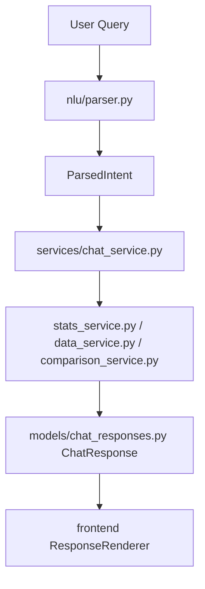

# SoccerSolver Player Analysis

## Overview
SoccerSolver is a full-stack football analytics application built for the technical challenge submission. It provides four connected experiences over a single deterministic data and service layer:

1. Player search
2. Individual player profile with contextual percentiles
3. Two-player comparison with per-90 and market context
4. Natural-language chat interface

The application uses 2021-22 player-season data from Europe’s Big Five leagues.

This project is an assessment implementation, not a live production scouting platform.

## Features
### Search
- Player-name search with case-insensitive matching
- Debounced search requests in the frontend
- Request cancellation via AbortController to avoid outdated responses
- Estimated market value shown in results
- Direct links to individual player profile pages

### Profile
- Player identity and season totals
- Optional provider-backed player portrait with deterministic initials fallback
- Goals, assists, minutes, shots, passes, xG and xA
- Contextual percentiles against same-position and same-league peers
- Graceful fallback when percentile context is unavailable

### Comparison
- Search and select two players
- Query-parameter preselection from profile page links
- Backend-derived per-90 comparisons for core metrics
- Explicit metric winners (including draw handling)
- Estimated market value and peer-average context
- Same-player comparison support

### Chat
- Ranking queries
- Player lookup queries
- Two-player comparison queries
- Clarification and failure responses
- Structured text, table, chart and comparison response types

## Demo workflow
1. Search for a known player (example: Mohamed Salah).
2. Open the player profile and review season stats plus contextual percentiles.
3. Jump to compare from the profile page and add a second player.
4. Review per-90 winners and market context.
5. Open chat and run:
   - Ranking query
   - Player lookup query
   - Comparison query
   - One ambiguous or out-of-scope query

## Architecture
### Chat architecture
```text
Natural-language request
        ↓
NLU parser
        ↓
Structured ParsedIntent
        ↓
Deterministic service execution
        ↓
Structured ChatResponse
        ↓
Frontend ResponseRenderer
```

### Backend separation
```text
routers/
    HTTP boundary

nlu/
    intent and entity extraction

services/
    CSV access
    statistics
    percentiles
    ranking
    comparison
    chat orchestration

models/
    Pydantic request and response contracts
```

### Frontend separation
```text
pages/
    route-level views

components/
    reusable presentation

api/
    typed HTTP client

types/
    backend-aligned TypeScript contracts

utils/
    shared formatting
```

### Optional player imagery
Player portraits are presentation-only enrichment and do not change player or
statistics response contracts. The frontend requests a portrait from
`GET /players/{player_id}/image`; the backend resolves the known player identity
and, when configured, calls a provider with `player_name`, `club`, and `league`
query parameters. The provider response may contain either `image_url` or `url`.

The integration is intentionally fallback-first:
- No provider is configured by default, and the UI renders deterministic initials.
- Provider credentials remain on the backend and are never added to the Vite bundle.
- Only absolute `http` and `https` image URLs are accepted.
- Provider calls have a three-second timeout and do not retry.
- Lookup failures, invalid responses and broken images fall back without affecting core views.
- Successful lookups are cached in process for 24 hours; missing images are cached for five minutes.

Production deployments are responsible for selecting a provider and ensuring
that portrait retrieval and display comply with the provider's terms and image
licensing requirements. No live image provider is bundled or required.

### Mermaid overview


## Technology stack
### Backend
- Python
- FastAPI
- Pydantic
- pandas
- pytest

### Frontend
- React
- TypeScript
- Vite
- React Router
- Recharts
- Vitest
- React Testing Library

### Runtime
- Docker
- Docker Compose
- nginx (frontend container)

## Dataset
- Source: FBref-derived data distributed through worldfootballR
- Coverage: Europe’s Big Five leagues
- Season: 2021-22
- Final dataset size: 2,442 unique players

Final columns:
- player_id
- name
- position
- age
- club
- league
- market_value_eur
- goals
- assists
- minutes_played
- shots
- passes
- xg
- xa

Data processing notes:
- Transfer-season records are aggregated into one player-season record.
- Club and league are assigned from the team where the player logged the most minutes.
- Duplicate player IDs are validated.
- Dataset validation tooling exists in backend/scripts/validate_dataset.py.

Important valuation note:
- market_value_eur is a deterministic estimate created for this assessment.
- It is not a live feed and not an official transfer valuation.

## Statistical methodology
Per-90 formula:

$$
\text{metric\_per\_90} = \frac{\text{metric}}{\text{minutes\_played}} \times 90
$$

Method details:
- Per-90 metrics require positive minutes.
- Ranking is deterministic and computed in backend services.
- Invalid and non-finite values are controlled at model/serialization boundaries.

Percentiles:
- Calculated against players in the same league and position.
- Peer groups apply backend minimum-minutes filtering.
- Percentile values are computed in the backend.
- Frontend only visualizes returned percentile values.

Comparison:
- Per-90 values are computed in backend comparison logic.
- Winners are assigned in backend logic.
- Frontend does not recalculate winners.
- A tolerance can yield draws for near-equal metrics.

Market context:
- Includes each selected player’s estimated market value.
- Includes average estimated value for same-position and same-league peers.
- Peer average can be unavailable for empty peer groups.

## Conversational layer
Current approach:
- Rule-based parser is always available.
- Optional OpenAI tool/function calling can be enabled via environment variable.
- Model output is validated and normalized.
- Rule-based fallback remains available.
- Player names must be grounded in the original user query.
- Incomplete or invalid intents become clarification responses.

Supported intent types:
```text
ranking
player_lookup
comparison
unknown
```

Example queries:
```text
Top 5 forwards in the Premier League by goals
Top 5 wingers under 23 in La Liga by assists per 90
Show me Mohamed Salah
Compare Mohamed Salah and Harry Kane
Who is the best player?
```

Limitations of conversational behavior:
- No conversational memory.
- No follow-up reference resolution (for example: compare him with Kane).
- No live football knowledge.
- Only dataset-backed player queries.
- Rule-based parser supports a defined query-pattern set.
- Optional LLM parsing can improve wording coverage but does not execute calculations.

## Correctness and hallucination controls
- The language model never produces final football numbers.
- Rankings, per-90 values, percentiles, comparisons and market context are deterministic backend outputs.
- NLU only selects intent and entities.
- Player names are resolved against the dataset.
- Ambiguous player matches trigger clarification.
- Unknown players return controlled errors.
- Structured response models prevent untyped free-form numerical output.
- Frontend renders backend values and does not recalculate football statistics.

## Local setup with Docker
Required command:

```bash
docker-compose up --build
```

Application URLs:
- Frontend: http://localhost:3000
- Backend: http://localhost:8000
- Health: http://localhost:8000/health
- OpenAPI: http://localhost:8000/docs

Stop:

```bash
docker-compose down
```

Rebuild from scratch:

```bash
docker-compose down
docker-compose up --build
```

Direct frontend route refreshes verified:
- /
- /player/<id>
- /compare
- /chat

## Local setup without Docker
### Backend
```bash
cd backend
python -m venv .venv
```

Windows PowerShell:
```powershell
.venv\Scripts\Activate.ps1
```

macOS/Linux:
```bash
source .venv/bin/activate
```

Then:
```bash
pip install -r requirements.txt
uvicorn main:app --reload
```

### Frontend
```bash
cd frontend
npm install
npm run dev
```

Vite dev URL: http://localhost:5173

## Environment variables
Primary variables used by the application:

Backend:
```env
OPENAI_API_KEY=
OPENAI_MODEL=gpt-4o-mini
PLAYER_IMAGE_PROVIDER=
PLAYER_IMAGE_API_KEY=
PLAYER_IMAGE_API_BASE_URL=
```

Frontend:
```env
VITE_API_BASE_URL=http://localhost:8000
```

Notes:
- OpenAI parsing is optional.
- Without an API key, the rule-based parser remains active.
- Player imagery is optional. Set `PLAYER_IMAGE_PROVIDER=http` and provide the
  provider endpoint in `PLAYER_IMAGE_API_BASE_URL` to enable it.
- `PLAYER_IMAGE_API_KEY` is sent to the configured provider as a bearer token.
- Leaving the image variables blank preserves all functionality with initials fallbacks.
- Do not put secrets in frontend variables.
- Never commit a populated .env file.

## API endpoints
### GET /health
Purpose:
- Lightweight liveness endpoint.

Response:
- 200 with status payload.

### GET /players/search?q=<name>
Purpose:
- Case-insensitive name substring search.

Parameters:
- q (required): query string.

Responses:
- 200: list[PlayerSummary]
- 400: blank or whitespace-only q

### GET /players/{player_id}
Purpose:
- Player profile and contextual percentile payload.

Responses:
- 200: PlayerDetailWithPercentiles
- 404: unknown player ID

### GET /players/{player_id}/image
Purpose:
- Resolve an optional, presentation-only player portrait URL.

Responses:
- 200: player ID and nullable image URL
- 404: unknown player ID

### GET /players/compare?player_a_id=<id>&player_b_id=<id>
Purpose:
- Two-player deterministic comparison.

Responses:
- 200: ComparisonResult
- 404: one or both IDs not found

### POST /chat
Purpose:
- Parse natural-language request and return structured response.

Request body:
- ChatRequest with message

Responses:
- 200: ChatResponse (text, table, chart or comparison)
- 422: invalid request body schema

Concise example:

Request
```json
{
  "message": "Top 3 forwards in the Premier League by goals"
}
```

Response shape (table example)
```json
{
  "response": {
    "type": "table",
    "title": "Top 3 Premier League FWD by Goals per 90",
    "columns": ["rank", "name", "club", "league", "position", "metric_value", "metric_label"],
    "rows": [
      {
        "rank": 1,
        "name": "Mohamed Salah",
        "club": "Liverpool",
        "league": "Premier League",
        "position": "FWD",
        "metric_value": 0.749,
        "metric_label": "Goals per 90"
      }
    ]
  }
}
```

## Example chat queries
- Top 5 forwards in the Premier League by goals
- Top 5 wingers under 23 in La Liga by assists per 90
- Show me Mohamed Salah
- Compare Mohamed Salah and Harry Kane
- Who is the best player?

## Testing
Commands used:

Backend:
```bash
cd backend
pytest
```

Frontend:
```bash
cd frontend
npm test -- --run
npm run build
```

Latest observed results on this branch:
- Backend: 430 passed, 0 failed, 1 deprecation warning from dependency test client integration
- Frontend tests: 69 passed, 0 failed
- Frontend build: success
- Built assets:
  - dist/index.html 0.47 kB (gzip 0.30 kB)
  - dist/assets/index-BgnPpGp1.css 29.10 kB (gzip 5.88 kB)
  - dist/assets/index-Dfz0QGl3.js 272.56 kB (gzip 84.86 kB)
  - dist/assets/ChartGraphic-ku52RMI2.js 407.37 kB (gzip 113.82 kB)

Coverage areas validated by tests:

Backend:
- Data access
- Ranking and percentile logic
- Player comparison
- NLU parser
- Chat response contracts
- Chat orchestration
- Failure semantics
- REST endpoint behavior
- Finite-number serialization behavior

Frontend:
- API client
- Search
- Profile
- Comparison
- Chat
- Dynamic response rendering
- Request cancellation
- Stale-response prevention
- Accessibility behavior
- Error and retry states
- Player portrait and deterministic initials fallback behavior

Docker verification performed:
- docker-compose down --remove-orphans
- docker-compose build --no-cache
- docker-compose up (and up --build)
- Health endpoint returned 200
- Frontend loaded and returned 200 on direct routes

## Project structure
```text
soccersolver-assessment/
├── backend/
│   ├── data/
│   ├── models/
│   ├── nlu/
│   ├── routers/
│   ├── services/
│   └── tests/
├── frontend/
│   ├── src/
│   │   ├── api/
│   │   ├── components/
│   │   ├── pages/
│   │   ├── types/
│   │   └── utils/
├── docker-compose.yml
└── README.md
```

## Design decisions and trade-offs
### Why CSV
- Dataset size is appropriate for assessment scope.
- Easy local reproducibility.
- Data access is abstracted behind a service to allow future storage replacement.

### Why rule-based plus optional LLM parsing
- Deterministic baseline works without paid dependencies.
- Optional model support improves language-variation handling.
- Model output remains validated before execution.

### Why a structured chat response union
- Frontend can safely render known response types.
- OpenAPI contract remains explicit.
- Avoids untyped raw strings and ad hoc chart payloads.

### Why calculations are in backend services
- Consistent behavior across REST and chat.
- Better testability.
- Avoids hallucinated numerical outputs.

### Why horizontal percentile bars in profile
- Faster side-by-side interpretation than radar-only profile visualization.
- Good accessibility support with text labels and values.

### Why chat charts are lazy-loaded
- Recharts code is not loaded in the initial bundle unless chart responses are rendered.

## Error handling
### REST
- 400 for explicitly handled invalid client input (for example blank search q).
- 404 for unknown player IDs.
- 422 for schema-validation failures.
- Internal errors are returned without exposing stack traces.

### Chat
- HTTP 200 for valid request bodies, including clarifications and user-correctable failures.
- TextResponse.is_error=false for clarifications.
- TextResponse.is_error=true for execution-blocking failures.
- 422 only for invalid request body schema.

### Frontend
- Loading states
- Empty states
- Safe error messages
- Retry controls
- Cancelled requests ignored
- Stale response protection

## Accessibility and frontend UX
Implemented examples:
- Semantic page headings
- Labeled inputs and textareas
- Keyboard-accessible buttons and links
- Live regions for loading and chat updates
- Alert roles for error states
- Accessible tables for ranking and chart values
- Chart value tables provided as text alternatives
- Winner labels are explicit in text, not color-only
- Visible focus states in interactive controls
- Responsive layouts verified on mobile viewport

No formal WCAG certification is claimed.

## Known limitations
- Historical 2021-22 dataset only
- Estimated market values, not official transfer valuations
- No authentication
- No persistent storage
- No conversation history
- No live football APIs
- No deployment pipeline
- No advanced player-name disambiguation beyond available candidates
- Limited natural-language coverage in rule-based mode
- No localization
- Comparison metrics are fixed to the implemented backend set

## Future improvements
- Replace CSV with PostgreSQL or analytics warehouse
- Scheduled data ingestion pipeline
- Live/current-season data support
- Richer player identity metadata
- Embeddings or stronger structured-query layer
- Conversational context and follow-up resolution
- User-saved comparisons
- Authentication and user accounts
- CI/CD pipeline
- Browser end-to-end tests
- Observability and telemetry
- Caching strategy
- Production deployment
- Expanded league coverage

## AI-assisted development

I used AI-assisted development tools as a productivity aid for boilerplate, UI scaffolding, refactoring suggestions, test generation and documentation drafting. Core product decisions, data modelling, service boundaries, query handling, statistical calculations and validation were designed and reviewed by me.

The conversational layer may optionally use an LLM for query understanding, but all computed outputs—including rankings, percentiles, per-90 values, player comparisons and market context—are produced deterministically by the backend data and service layers. The model does not invent player statistics or calculate final results directly.

## Submission checklist
- [x] Public GitHub repository
- [x] Docker Compose verified
- [x] Backend tests pass
- [x] Frontend tests pass
- [x] Production frontend build passes
- [x] README reviewed
- [x] `.env.example` present
- [ ] Demo video recorded
- [ ] At least three live chat queries shown
- [ ] One ambiguous or failed query shown
- [ ] Repository and video links emailed

### Manual smoke-test checklist (this verification pass)
Search:
- [x] Known player
- [x] Unknown player
- [ ] Backend unavailable and retry flow (covered by frontend automated tests; not re-run manually in this pass)

Profile:
- [x] Valid player
- [x] Invalid ID
- [x] Direct refresh

Comparison:
- [x] Two different players
- [x] Same player
- [x] Profile preselection
- [x] Invalid preselected ID

Chat:
- [x] Ranking
- [x] Player lookup
- [x] Comparison
- [x] Vague clarification
- [x] Incomplete comparison
- [x] Unknown player
- [x] Out-of-scope request

Responsive:
- [x] Mobile-width Search
- [x] Mobile-width Profile
- [x] Mobile-width Compare
- [x] Mobile-width Chat

### Repository hygiene checks
- [x] No committed .env file
- [x] No API keys committed
- [x] No generated artifacts tracked in git status (dist/node_modules/cache folders are local only)
- [x] No stale placeholder copy in README

## Video guidance
Suggested 4-7 minute demo structure:

1. 20-30 seconds: problem statement and architecture
2. Search for a player
3. Open profile and explain peer percentiles
4. Compare two players
5. Chat ranking query
6. Chat player lookup
7. Chat comparison
8. Show one clarification or failure
9. Briefly explain correctness controls
10. Mention trade-offs and next improvements
